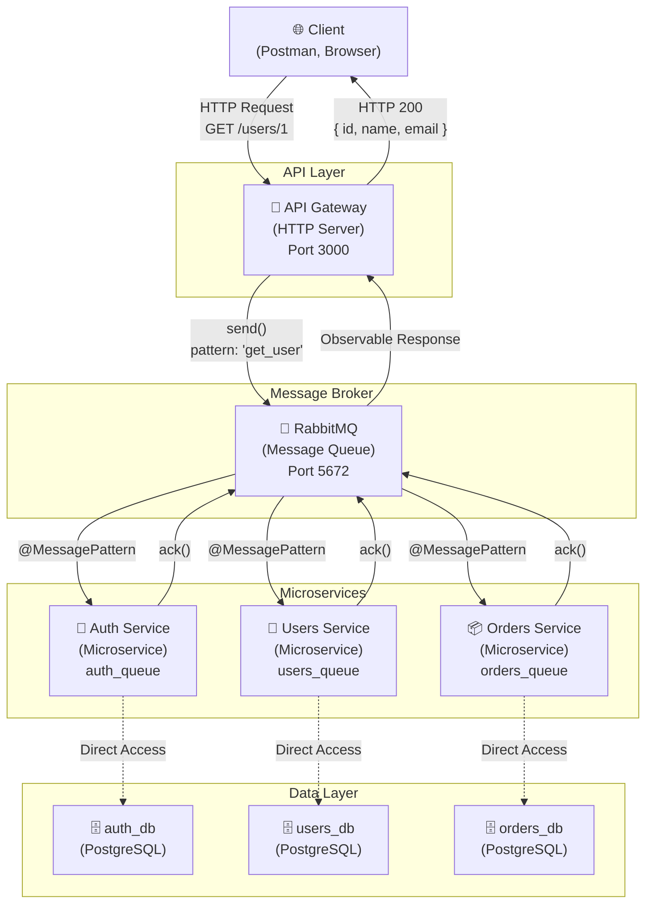
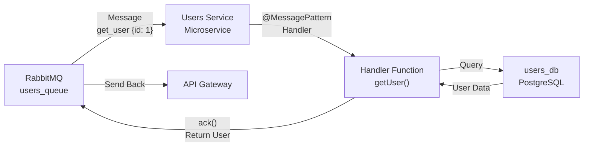
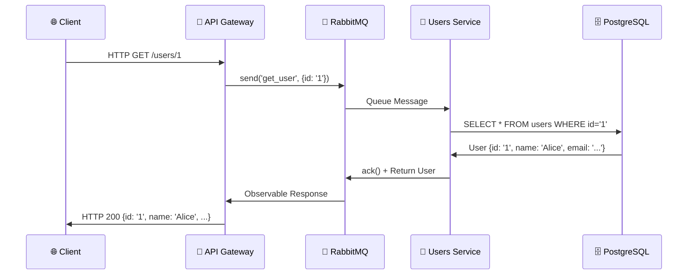
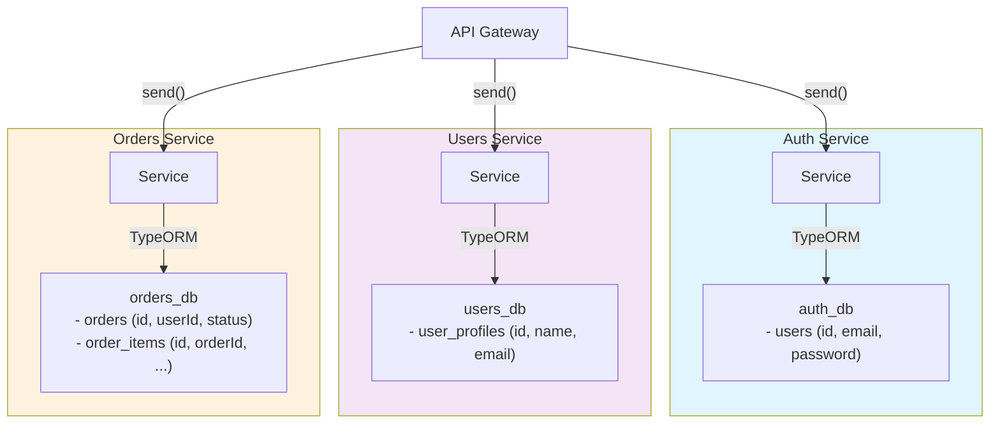

# 마이크로서비스 아키텍처 설계 문서

## 개요

이 프로젝트는 **API Gateway + RabbitMQ 기반 마이크로서비스 아키텍처**입니다.
각 도메인(Auth, Users, Orders)이 독립적인 서비스로 분리되어 있으며, 메시지 큐를 통해 비동기 통신합니다.

---

## 전체 아키텍처



---

## 핵심 개념: API Gateway의 역할

### ✅ API Gateway의 책임

API Gateway는 **HTTP ↔ RabbitMQ 변환기** 역할을 합니다.

```mermaid
graph LR
    H1["🌐 HTTP Client"]
    GW["API Gateway<br/>Controllers"]
    RMQ["RabbitMQ<br/>Message Queue"]
    MS["Microservice<br/>@MessagePattern"]

    H1 -->|HTTP<br/>GET /users/1| GW
    GW -->|send()<br/>USERS_PATTERNS.GET_USER| RMQ
    RMQ -->|Queue Message| MS
    MS -->|Process &<br/>Return Data| RMQ
    RMQ -->|Observable| GW
    GW -->|lastValueFrom()<br/>HTTP 200| H1
```

### API Gateway의 코드 흐름

```typescript
// api-gateway/src/users/users.controller.ts
@Get(':id')
async getUser(@Param('id') id: string) {
  try {
    // 1️⃣ RabbitMQ에 메시지 전송
    return await lastValueFrom(
      this.usersClient.send(USERS_PATTERNS.GET_USER, { id })
        .pipe(timeout(5000))
    );
    // 2️⃣ users-service가 처리하는 동안 대기
    // 3️⃣ 응답을 받아 HTTP로 반환
  } catch (error) {
    return { error: '...' };
  }
}
```

---

## 마이크로서비스의 역할

### ✅ Microservice의 책임

마이크로서비스는 **RabbitMQ 메시지 리스너** 역할을 합니다.



### Microservice의 코드 흐름

```typescript
// users-service/src/users-service.controller.ts
@MessagePattern(USERS_PATTERNS.GET_USER)
getUser(data: any, @Ctx() ctx: RmqContext) {
  // 1️⃣ 메시지 수신
  // 2️⃣ 처리 완료 직후 ACK (수동 확인)
  const channel = ctx.getChannelRef();
  channel.ack(ctx.getMessage());

  // 3️⃣ 데이터 처리 (DB 조회, 비즈니스 로직)
  return this.usersService.getUser(data.id);
  // 4️⃣ RabbitMQ를 통해 응답 전송
}
```

---

## 통신 흐름 (Request-Reply Pattern)

### 시나리오: 클라이언트가 `GET /users/1` 요청



---

## 서비스 간 통신 패턴

### 1️⃣ Request-Reply (send + @MessagePattern)

**사용 사례**: 응답이 필요한 동기 작업 (users, orders, auth)

```typescript
// API Gateway (요청 측)
this.usersClient.send(USERS_PATTERNS.GET_USER, { id })

// Users Service (응답 측)
@MessagePattern(USERS_PATTERNS.GET_USER)
getUser(data: any) {
  return this.usersService.getUser(data.id);  // 반드시 반환
}
```

### 2️⃣ Fire-and-Forget (emit + @EventPattern)

**사용 사례**: 응답 불필요한 비동기 작업 (notifications)

```typescript
// Orders Service (발행 측)
this.notificationClient.emit(ORDER_EVENTS.CREATED, orderData)

// Notifications Service (구독 측)
@EventPattern(ORDER_EVENTS.CREATED)
onOrderCreated(data: any) {
  this.notificationService.sendEmail(data.email);  // 반환 불필요
}
```

---

## 데이터 흐름과 일관성

### Database-per-Service 패턴



### 핵심 원칙

✅ **각 서비스는 자신의 DB만 소유**
```typescript
// ✅ 옳음: 자신의 DB 조회
const user = await userRepository.findById(userId);

// ❌ 틀림: 다른 서비스의 DB 직접 접근
const order = await ordersDB.query(...);  // 금지!

// ✅ 올바른 방식: RabbitMQ를 통한 통신
this.usersClient.send(USERS_PATTERNS.GET_USER, { id: userId })
```

✅ **크로스 서비스 데이터는 RabbitMQ로만 통신**
```typescript
// orders-service에서 user 정보가 필요할 때
// ❌ orders_db의 users 테이블 조회 금지
// ✅ users-service에 요청
const user = await this.usersClient.send(GET_USER, { id }).toPromise();
```

✅ **userId는 논리적 참조** (외래키 없음)
```typescript
@Entity('orders')
export class Order {
  @Column('uuid')
  userId: string;  // 외래키 제약 없음! (MSA 원칙)
}
```

---

## 개발 환경 실행

### 아키텍처 관점에서 이해하기

```
┌─────────────────────────────────────────────────────────────┐
│                    로컬 개발 환경                             │
├─────────────────────────────────────────────────────────────┤
│ Docker (Infrastructure)                                      │
│  ├─ PostgreSQL:5432 (Database Layer)                        │
│  │   ├─ auth_db (Auth Service 전담)                         │
│  │   ├─ users_db (Users Service 전담)                       │
│  │   └─ orders_db (Orders Service 전담)                     │
│  │                                                            │
│  └─ RabbitMQ:5672 (Message Broker Layer)                    │
│      ├─ auth_queue (Auth Service 전담)                      │
│      ├─ users_queue (Users Service 전담)                    │
│      └─ orders_queue (Orders Service 전담)                  │
│                                                               │
├─────────────────────────────────────────────────────────────┤
│ Local (Node.js Applications) - HMR 활성화                    │
│  ├─ pnpm run start:dev --project api-gateway                │
│  │  (HTTP Server, RabbitMQ Client 역할)                     │
│  │                                                            │
│  ├─ pnpm run start:dev --project users-service              │
│  │  (RabbitMQ Listener, TypeORM Client 역할)                │
│  │                                                            │
│  ├─ pnpm run start:dev --project auth-service               │
│  │  (RabbitMQ Listener, TypeORM Client 역할)                │
│  │                                                            │
│  └─ pnpm run start:dev --project orders-service             │
│     (RabbitMQ Listener, TypeORM Client 역할)                │
│                                                               │
└─────────────────────────────────────────────────────────────┘
```

### 구체적인 실행 방법

```bash
# 터미널 1: 인프라 시작 (Docker)
docker compose up -d

# 터미널 2: API Gateway (HTTP 진입점)
# 역할: HTTP 요청을 받아 RabbitMQ 메시지로 변환
pnpm run start:dev --project api-gateway
# → http://localhost:3000/health

# 터미널 3: Users Service (마이크로서비스)
# 역할: users_queue에서 메시지 수신 → 처리 → 응답
pnpm run start:dev --project users-service

# 터미널 4: Auth Service (마이크로서비스)
pnpm run start:dev --project auth-service

# 터미널 5: Orders Service (마이크로서비스)
pnpm run start:dev --project orders-service
```

---

## 핵심 파일 맵핑

### API Gateway (HTTP ↔ RabbitMQ 변환)
```
apps/api-gateway/src/
├── main.ts                       # HTTP 서버 진입점
├── api-gateway.module.ts         # ClientProxy 등록 (3개 서비스)
├── users/
│   └── users.controller.ts       # @Get, @Post 라우터
│                                 # → usersClient.send()
├── auth/
│   └── auth.controller.ts
└── orders/
    └── orders.controller.ts
```

### Microservice (RabbitMQ Listener)
```
apps/users-service/src/
├── main.ts                       # 마이크로서비스 진입점
│                                 # (NestFactory.createMicroservice)
├── users-service.module.ts       # TypeOrmModule 등록 (users_db)
├── users-service.controller.ts   # @MessagePattern 핸들러
│                                 # → channel.ack()
├── users-service.service.ts      # 비즈니스 로직 (DB 조회)
├── profiles/
│   └── user-profile.entity.ts    # TypeORM 엔티티
```

### Shared Library (공유 인프라)
```
libs/shared/src/
├── database/
│   └── database.config.ts        # TypeOrmModule.forRootAsync() 팩토리
├── patterns/index.ts             # USERS_PATTERNS 등 상수
└── rmq/
    └── rmq.service.ts            # ack() 헬퍼
```

---

## 흐름도 요약

### 1️⃣ 정상 흐름 (성공)

```
Client HTTP Request (GET /users/1)
    ↓
API Gateway Controller
    ↓ (find ClientProxy 'USERS_SERVICE')
API Gateway sends() to RabbitMQ
    ↓
RabbitMQ routes to users_queue
    ↓
Users Service @MessagePattern listens
    ↓
Users Service Handler executes
    ↓ (channel.ack() → 메시지 처리 완료)
Users Service returns data
    ↓ (RabbitMQ reply-to queue)
API Gateway receives Observable
    ↓ (lastValueFrom() → Promise)
API Gateway HTTP Response
    ↓
Client receives JSON
```

### 2️⃣ 에러 흐름 (타임아웃)

```
Client HTTP Request (GET /users/1)
    ↓
API Gateway sends() to RabbitMQ
    ↓
[5초 대기... Users Service 응답 없음]
    ↓
timeout(5000) 실행
    ↓ (catch error)
API Gateway returns error response
    ↓
Client receives { error: 'Failed to fetch user' }
```

---

## 왜 이런 구조일까?

### API Gateway가 필요한 이유

| 항목            | 이유                                  |
| --------------- | ------------------------------------- |
| **라우팅**      | 하나의 HTTP 진입점으로 모든 요청 처리 |
| **변환**        | HTTP ↔ RabbitMQ 프로토콜 변환         |
| **캐싱**        | 클라이언트-측 응답 캐싱 (선택사항)    |
| **인증**        | JWT 검증 중앙화 (향후 추가)           |
| **레이트 제한** | API 속도 제한 (향후 추가)             |

### Microservice 분리 이유

| 항목            | 이유                                     |
| --------------- | ---------------------------------------- |
| **독립 배포**   | 각 서비스를 따로 배포/업데이트           |
| **스케일링**    | 특정 서비스만 수평 확장                  |
| **장애 격리**   | 한 서비스 장애가 다른 서비스에 영향 없음 |
| **기술 독립성** | 각 서비스가 다른 기술 스택 사용 가능     |

### RabbitMQ 필요 이유

| 항목            | 이유                                        |
| --------------- | ------------------------------------------- |
| **비동기**      | HTTP 타임아웃 없이 메시지 버퍼링            |
| **신뢰성**      | 메시지 손실 방지 (persistent, noAck: false) |
| **느슨한 결합** | 서비스 간 직접 의존성 제거                  |
| **부하 분산**   | 여러 워커가 같은 큐 처리                    |

---

## 현재 상태

✅ **구현 완료**
- API Gateway HTTP 라우터 (health, users, auth, orders)
- Users Service RabbitMQ 리스너
- Database-per-Service (PostgreSQL 3개 DB)
- ClientProxy + MessagePattern 통신
- 통합 테스트 (8/8 pass)

⏳ **향후 추가**
- Auth Service 인증 로직
- Orders Service 주문 처리
- Notifications Service 이메일/SMS
- API Gateway 인증 미들웨어
- 서비스 간 saga 패턴 (분산 트랜잭션)

---

## 참고

- `CLAUDE.md`: 개발 환경 설정 및 실행 방법
- `apps/api-gateway/test/integration.spec.ts`: 통합 테스트 (아키텍처 검증)
- `libs/shared/src/patterns/index.ts`: 메시지 패턴 상수
