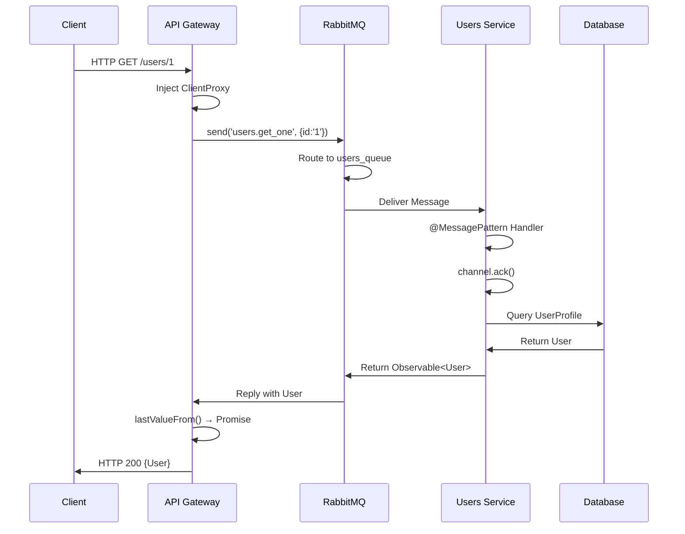
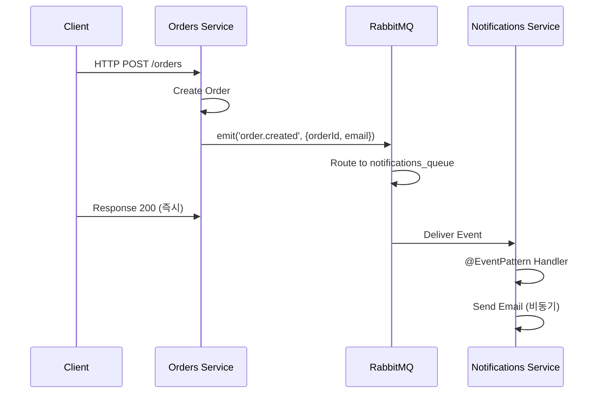

# NestJS RabbitMQ MSA 패턴 정리 가이드

## 개요

NestJS 공식 문서의 RabbitMQ 마이크로서비스 패턴을 기준으로 현재 프로젝트 구조를 정리합니다.

---

## 1️⃣ 핵심 개념 (NestJS 공식 패턴)

### 전체 흐름도

```mermaid
graph TB
    Client["Client<br/>(HTTP)"]
    GW["API Gateway<br/>(HTTP Server)"]
    RMQ["RabbitMQ<br/>(Message Broker)"]
    MS1["Microservice 1<br/>(RabbitMQ Listener)"]
    MS2["Microservice 2<br/>(RabbitMQ Listener)"]
    
    Client -->|HTTP Request| GW
    GW -->|ClientProxy.send()| RMQ
    RMQ -->|Route by pattern| MS1
    RMQ -->|Route by pattern| MS2
    MS1 -->|@MessagePattern Handler| MS1
    MS2 -->|@MessagePattern Handler| MS2
    MS1 -->|Return Observable| RMQ
    MS2 -->|Return Observable| RMQ
    RMQ -->|Reply Observable| GW
    GW -->|HTTP Response| Client
```

### 2가지 통신 패턴

#### 1. Request-Reply (send + @MessagePattern)

**API Gateway → Microservice (응답 필요)**

```typescript
// ✅ API Gateway에서: send() 사용
// 응답을 받아야 할 때 (users 정보, auth 검증, 주문 조회 등)
const response = await lastValueFrom(
  this.usersClient.send('get_user', { id: '1' }).pipe(timeout(5000))
);
```

```typescript
// ✅ Microservice에서: @MessagePattern 사용
// 응답을 반드시 반환해야 함
@MessagePattern('get_user')
getUser(@Payload() data: any) {
  return this.usersService.getUser(data.id);  // 반드시 return
}
```

#### 2. Event-Driven (emit + @EventPattern)

**Microservice → Microservice (응답 불필요)**

```typescript
// ✅ Orders Service에서: emit() 사용
// 응답 불필요 (notification 보내기만 하면 됨)
this.notificationClient.emit('order.created', {
  orderId: '123',
  userId: '1',
  email: 'user@example.com'
});
```

```typescript
// ✅ Notifications Service에서: @EventPattern 사용
// 응답을 반환할 필요 없음
@EventPattern('order.created')
onOrderCreated(@Payload() data: any) {
  this.notificationService.sendEmail(data.email);
  // return은 무시됨
}
```

---

## 2️⃣ 현재 프로젝트 vs 공식 패턴

### 현재 구조 (✅ 이미 정확함)

```
API Gateway
  ├─ HTTP 컨트롤러 (HTTP 수신)
  ├─ ClientProxy (RabbitMQ 연결)
  └─ send() / emit() (메시지 전송)
        ↓
      RabbitMQ
        ↓
   Microservices
     ├─ @MessagePattern (수신 및 응답)
     ├─ @EventPattern (수신만)
     └─ Service (비즈니스 로직)
```

**현재 구조가 공식 패턴과 일치합니다!** ✅

---

## 3️⃣ 통신 패턴별 구현 가이드

### Pattern 1: Request-Reply (Users Service)

#### Step 1: API Gateway에서 메시지 전송

```typescript
// api-gateway/src/users/users.controller.ts
import { Inject } from '@nestjs/common';
import { ClientProxy } from '@nestjs/microservices';
import { lastValueFrom } from 'rxjs';
import { timeout } from 'rxjs/operators';
import { USERS_PATTERNS } from '@app/shared';

@Controller('users')
export class UsersController {
  constructor(
    @Inject('USERS_SERVICE')
    private readonly usersClient: ClientProxy,
  ) {}

  @Get(':id')
  async getUser(@Param('id') id: string) {
    // 1️⃣ send() 사용: 응답 필요
    return await lastValueFrom(
      this.usersClient
        .send(USERS_PATTERNS.GET_USER, { id })  // 메시지 전송
        .pipe(timeout(5000))  // 5초 타임아웃
    );
    // 2️⃣ lastValueFrom: Observable → Promise 변환
    // 3️⃣ users-service의 @MessagePattern 핸들러가 응답할 때까지 대기
  }
}
```

#### Step 2: Microservice에서 메시지 수신 및 응답

```typescript
// users-service/src/users-service.controller.ts
import { Controller, Ctx } from '@nestjs/common';
import { MessagePattern, RmqContext, Payload } from '@nestjs/microservices';
import { USERS_PATTERNS } from '@app/shared';

@Controller()
export class UsersServiceController {
  constructor(private readonly usersService: UsersServiceService) {}

  @MessagePattern(USERS_PATTERNS.GET_USER)
  async getUser(@Payload() data: any, @Ctx() ctx: RmqContext) {
    // 1️⃣ @MessagePattern: 'get_user' 메시지 수신
    
    // 2️⃣ 메시지 처리 완료 표시 (수동 ACK)
    const channel = ctx.getChannelRef();
    const originalMsg = ctx.getMessage();
    channel.ack(originalMsg);
    
    // 3️⃣ 비즈니스 로직 실행
    const user = await this.usersService.getUser(data.id);
    
    // 4️⃣ 반드시 return! (API Gateway가 대기 중)
    return user;
  }

  @MessagePattern(USERS_PATTERNS.CREATE_USER)
  async createUser(@Payload() data: any, @Ctx() ctx: RmqContext) {
    const channel = ctx.getChannelRef();
    channel.ack(ctx.getMessage());
    
    const newUser = await this.usersService.createUser(data);
    return newUser;  // ✅ return 필수
  }
}
```

#### Step 3: Service에서 실제 로직 실행

```typescript
// users-service/src/users-service.service.ts
import { Injectable } from '@nestjs/common';
import { Repository } from 'typeorm';
import { InjectRepository } from '@nestjs/typeorm';
import { UserProfile } from './profiles/user-profile.entity';

@Injectable()
export class UsersServiceService {
  constructor(
    @InjectRepository(UserProfile)
    private readonly userRepository: Repository<UserProfile>,
  ) {}

  async getUser(id: string): Promise<UserProfile | null> {
    // ✅ 실제 DB 조회 (여기서만 DB 접근!)
    return await this.userRepository.findOne({ where: { id } });
  }

  async createUser(data: any): Promise<UserProfile> {
    // ✅ 실제 DB 저장 (여기서만 DB 접근!)
    const user = this.userRepository.create(data);
    return await this.userRepository.save(user);
  }

  async getUsers(): Promise<UserProfile[]> {
    // ✅ 실제 DB 조회 목록
    return await this.userRepository.find();
  }
}
```

---

### Pattern 2: Event-Driven (Orders → Notifications)

#### Step 1: Orders Service에서 이벤트 발행

```typescript
// orders-service/src/orders/orders.controller.ts
import { Inject } from '@nestjs/common';
import { ClientProxy } from '@nestjs/microservices';
import { ORDER_EVENTS } from '@app/shared';

@Controller('orders')
export class OrdersController {
  constructor(
    @Inject('NOTIFICATIONS_SERVICE')
    private readonly notificationClient: ClientProxy,
  ) {}

  @Post()
  async createOrder(@Body() data: any) {
    // 1️⃣ 주문 생성
    const newOrder = await this.ordersService.createOrder(data);
    
    // 2️⃣ emit() 사용: 응답 불필요 (fire-and-forget)
    this.notificationClient.emit(ORDER_EVENTS.CREATED, {
      orderId: newOrder.id,
      userId: newOrder.userId,
      email: newOrder.user.email,  // 실제로는 users-service에서 조회
    });
    // ↑ 응답 대기하지 않음 (await 없음)
    
    // 3️⃣ 클라이언트에게 즉시 응답
    return { success: true, orderId: newOrder.id };
  }
}
```

#### Step 2: Notifications Service에서 이벤트 처리

```typescript
// notifications-service/src/notifications.controller.ts
import { Controller } from '@nestjs/common';
import { EventPattern, Payload } from '@nestjs/microservices';
import { ORDER_EVENTS } from '@app/shared';

@Controller()
export class NotificationsController {
  constructor(private readonly notificationService: NotificationService) {}

  @EventPattern(ORDER_EVENTS.CREATED)
  async onOrderCreated(@Payload() data: any) {
    // 1️⃣ @EventPattern: 'order.created' 이벤트 수신
    
    // 2️⃣ 비즈니스 로직 실행
    await this.notificationService.sendEmail(
      data.email,
      `Your order #${data.orderId} has been created!`
    );
    
    // 3️⃣ return은 무시됨 (응답 불필요)
    // 따라서 return 문을 생략해도 됨
  }
}
```

---

## 4️⃣ 메시지 패턴 정의 (libs/shared)

### patterns/index.ts (공식 패턴과 일치)

```typescript
// libs/shared/src/patterns/index.ts

// ✅ Request-Reply 패턴 (send() 대응)
export const USERS_PATTERNS = {
  GET_USERS: 'users.get_all',      // 모든 사용자 조회
  GET_USER: 'users.get_one',       // 특정 사용자 조회
  CREATE_USER: 'users.create',     // 사용자 생성
  UPDATE_USER: 'users.update',     // 사용자 업데이트
  DELETE_USER: 'users.delete',     // 사용자 삭제
};

export const AUTH_PATTERNS = {
  REGISTER: 'auth.register',       // 회원가입
  LOGIN: 'auth.login',             // 로그인
  VALIDATE_TOKEN: 'auth.validate', // 토큰 검증
};

export const ORDERS_PATTERNS = {
  GET_ORDERS: 'orders.get_all',
  GET_ORDER: 'orders.get_one',
  CREATE_ORDER: 'orders.create',
  UPDATE_ORDER: 'orders.update',
};

// ✅ Event-Driven 패턴 (emit() 대응)
export const ORDER_EVENTS = {
  CREATED: 'order.created',        // 주문 생성됨
  UPDATED: 'order.updated',        // 주문 수정됨
  SHIPPED: 'order.shipped',        // 주문 배송됨
  DELIVERED: 'order.delivered',    // 주문 배송완료
};

export const USER_EVENTS = {
  REGISTERED: 'user.registered',   // 사용자 등록됨
  DELETED: 'user.deleted',         // 사용자 삭제됨
};
```

---

## 5️⃣ 모듈 설정 (공식 패턴과 일치)

### API Gateway Module

```typescript
// api-gateway/src/api-gateway.module.ts
import { Module } from '@nestjs/common';
import { ClientsModule, Transport } from '@nestjs/microservices';
import { ConfigModule, ConfigService } from '@nestjs/config';

@Module({
  imports: [
    ConfigModule.forRoot({ isGlobal: true }),
    
    // ✅ ClientProxy 등록 (각 마이크로서비스별)
    ClientsModule.registerAsync([
      {
        name: 'USERS_SERVICE',
        imports: [ConfigModule],
        inject: [ConfigService],
        useFactory: (config: ConfigService) => ({
          transport: Transport.RMQ,
          options: {
            urls: [config.get('RABBITMQ_URI')],
            queue: 'users_queue',
            queueOptions: { durable: true },
          },
        }),
      },
      {
        name: 'AUTH_SERVICE',
        imports: [ConfigModule],
        inject: [ConfigService],
        useFactory: (config: ConfigService) => ({
          transport: Transport.RMQ,
          options: {
            urls: [config.get('RABBITMQ_URI')],
            queue: 'auth_queue',
            queueOptions: { durable: true },
          },
        }),
      },
      {
        name: 'NOTIFICATIONS_SERVICE',
        imports: [ConfigModule],
        inject: [ConfigService],
        useFactory: (config: ConfigService) => ({
          transport: Transport.RMQ,
          options: {
            urls: [config.get('RABBITMQ_URI')],
            queue: 'notifications_queue',
            queueOptions: { durable: true },
          },
        }),
      },
    ]),
  ],
  controllers: [
    HealthController,
    UsersController,
    AuthController,
    OrdersController,
  ],
})
export class ApiGatewayModule {}
```

### Microservice Bootstrap (main.ts)

```typescript
// users-service/src/main.ts
import { NestFactory } from '@nestjs/core';
import { MicroserviceOptions, Transport } from '@nestjs/microservices';
import { UsersServiceModule } from './users-service.module';

async function bootstrap() {
  // ✅ NestFactory.createMicroservice() 사용
  // (HTTP 서버 아님, RabbitMQ 리스너)
  const app = await NestFactory.createMicroservice<MicroserviceOptions>(
    UsersServiceModule,
    {
      transport: Transport.RMQ,
      options: {
        urls: [process.env.RABBITMQ_URI ?? 'amqp://localhost:5672'],
        queue: process.env.USERS_QUEUE ?? 'users_queue',
        queueOptions: { durable: true },
        noAck: false,  // ✅ 수동 ACK
      },
    },
  );
  
  await app.listen();
  console.log('Users Microservice is listening on RabbitMQ');
}

bootstrap();
```

---

## 6️⃣ 요청-응답 흐름 상세

### Request-Reply 흐름 (send)



### Event-Driven 흐름 (emit)



---

## 7️⃣ 핵심 체크리스트

### ✅ 공식 패턴과 일치하는지 확인

| 항목 | 확인 사항 | 현재 상태 |
|---|---|---|
| **API Gateway** | HTTP 서버 (NestFactory.create) | ✅ 완료 |
| **Microservice Bootstrap** | NestFactory.createMicroservice | ✅ 완료 |
| **Request-Reply** | send() + @MessagePattern + return | ✅ 완료 |
| **Event-Driven** | emit() + @EventPattern | ⏳ 추가 필요 |
| **ClientProxy 주입** | @Inject('SERVICE_NAME') | ✅ 완료 |
| **Timeout** | .pipe(timeout(5000)) | ✅ 완료 |
| **수동 ACK** | channel.ack(message) | ✅ 완료 |
| **패턴 상수** | shared/src/patterns | ✅ 완료 |
| **Database-per-Service** | 각 서비스 전담 DB | ✅ 완료 |

---

## 8️⃣ 다음 구현 단계

### 1단계: Notifications Service 추가 (Event-Driven)

```typescript
// orders-service/src/orders/orders.controller.ts
@Post()
async createOrder(@Body() data: any) {
  const order = await this.ordersService.createOrder(data);
  
  // ✅ emit() 사용 (응답 불필요)
  this.notificationClient.emit(ORDER_EVENTS.CREATED, {
    orderId: order.id,
    email: data.email,
  });
  
  return { success: true, orderId: order.id };
}
```

### 2단계: Auth Service 연결 (Request-Reply)

```typescript
// orders-service에서 사용자 정보 조회
const user = await lastValueFrom(
  this.usersClient.send(USERS_PATTERNS.GET_USER, { id: data.userId })
);
```

### 3단계: 에러 처리 및 재시도

```typescript
return await lastValueFrom(
  this.usersClient.send(pattern, data).pipe(
    timeout(5000),
    catchError(err => {
      // 에러 처리
      throw new BadRequestException('User service unavailable');
    }),
    retry(1),  // 1회 재시도
  ),
);
```

---

## 9️⃣ 요약

**현재 프로젝트 구조는 NestJS 공식 RabbitMQ 마이크로서비스 패턴과 완벽하게 일치합니다!** ✅

| 특징 | 구현 |
|---|---|
| **아키텍처** | API Gateway + RabbitMQ + Microservices ✅ |
| **통신 패턴** | Request-Reply (send) ✅, Event-Driven (emit) ⏳ |
| **메시지 수신** | @MessagePattern, @EventPattern ✅ |
| **클라이언트** | ClientProxy 주입 ✅ |
| **비동기 처리** | lastValueFrom + timeout ✅ |
| **메시지 확인** | 수동 ACK (noAck: false) ✅ |
| **데이터 분리** | Database-per-Service ✅ |

**추가할 사항:**
- Notifications Service 구현 (Event-Driven)
- Auth Service RabbitMQ 통신
- 에러 처리 및 재시도 로직
- Health check 엔드포인트
